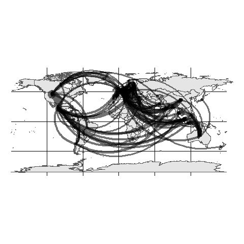

<!-- README.md is generated from README.Rmd. Please edit that file -->

# geoflowr

The goal of geoflowr is to …

## Installation

You can get the most recent version of geoflowr from
[Github](https://github.com/ropenscilabs/geoflowr) and install with:

``` r
devtools::install_github("ropenscilabs/geoflowr")
```

## The Problem

We are hopeing to plot spatial flows using `ggplot2` and then using
`gganimate` to show changes through time. There are many ways to do this
ouside `ggplot2` and there is already a `geom_curve()` functionthat
creates a plot similar

### Example Dataset

``` r

library(ggplot2)
library(readr)
library(purrr)
library(dplyr)
library(sf)
library(gganimate)

coords <- read_csv('data-raw/world.csv') %>% 
  filter(!is.na(admin)) %>%
  select(admin,
         x = Longitude, 
         y = Latitude)

#flows <- read_csv('data-raw/201802.csv') %>%
flows <- map_df(list.files(path = "data-raw", pattern = "[0-9].csv", full.names = TRUE), 
                 read_csv, col_names = TRUE) %>%
  select(year,
         period,
         reporter,
         partner,
         netweight_kg)
  
src <- coords %>%
  rename(reporter = admin)
dst <- coords %>% 
  rename(partner = admin)

# join coords to src and dst

df <- flows %>%
  left_join(src, by = 'reporter') %>%
  left_join(dst, by = 'partner', suffix = c('_src','_dst')) %>%
  filter(complete.cases(.))

world1 <- sf::st_as_sf(maps::map('world', plot = FALSE, fill = TRUE))
```

### Current ggplot implimentation - geom\_curve()

``` r

ggplot(df) + 
  geom_sf(data = world1) +
  geom_curve(aes(x = x_src, y = y_src, xend = x_dst, yend = y_dst, 
                 alpha = 0.5,
                 size = netweight_kg / max(df$netweight_kg)),
             #curvature = 0.75, angle = -45,
             arrow = arrow(length = unit(0.15,"cm"))
             ) +
  theme_void() + 
  theme(legend.position="none") +
  transition_time(period) +
  ease_aes('linear')
```


